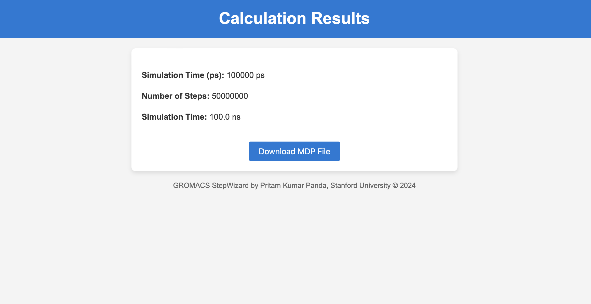

# GROMACS StepWizard
Struggling to determine the exact number of steps for your GROMACS molecular dynamics simulations? Meet GROMACS StepWizard – a powerful tool that automates step calculations for your desired simulation time in nanoseconds! GROMACS StepWizard is a also a web-based tool designed to help you easily generate production.mdp files for GROMACS simulations. It simplifies the process by allowing you to input desired simulation times and automatically calculates the required parameters.GROMACS StepWizard is a web-based tool designed to help you easily generate `production.mdp` files for GROMACS simulations. It simplifies the process by allowing you to input desired simulation times and automatically calculates the required parameters.

# Access the app here

https://gromacs-stepwizard-7e3791398062.herokuapp.com <br>

Youtube Link: https://www.youtube.com/watch?v=RWzqH28UeLE 

## Features

- Input simulation time in **picoseconds (ps)** or **nanoseconds (ns)**.
- Automatically calculates the **number of steps (`nsteps`)**.
- Generates a **production.mdp file** for GROMACS.
- Provides detailed information about important parameters like `dt`, `nsteps`, etc., through an easy-to-access help page.

---

## Technologies Used

- **Python** with Flask framework
- HTML/CSS for the front-end
- Deployed on Heroku

---

## How to Run the App Locally

### Prerequisites

1. Install Python (3.7 or higher).
2. Install `pip` (comes with Python installation).

### Steps

1. Clone the repository:
   ```bash
   git clone https://github.com/your-username/gromacs-stepwizard.git
   cd gromacs-stepwizard
   ```

2. Create a virtual environment and activate it:
   ```bash
   python -m venv venv
   source venv/bin/activate  # On Windows: venv\Scripts\activate
   ```

3. Install dependencies:
   ```bash
   pip install -r requirements.txt
   ```

4. Run the app:
   ```bash
   python app.py
   ```

5. Open your browser and navigate to:
   ```
   http://127.0.0.1:5000/
   ```

---

## How to Deploy to Heroku

### Prerequisites

1. Install the [Heroku CLI](https://devcenter.heroku.com/articles/heroku-cli).
2. Sign up for a [Heroku account](https://signup.heroku.com/).

### Steps

1. Log in to Heroku:
   ```bash
   heroku login
   ```

2. Create a new Heroku app:
   ```bash
   heroku create your-app-name
   ```

3. Push the code to Heroku:
   ```bash
   git push heroku main
   ```

4. Open your app:
   ```bash
   heroku open
   ```

---

## File Structure

```
project-folder/
│
├── app.py              # Main application file
├── requirements.txt    # Dependencies for the app
├── Procfile            # Heroku configuration file
├── runtime.txt         # (Optional) Specifies Python version
├── templates/          # HTML templates for the app
│   ├── index.html      # Main input page
│   ├── result.html     # Results display page
│   ├── info.html       # Help page for parameters
├── static/             # (Optional) Contains CSS/JS files
│   ├── style.css       # Styling for the app
└── production_files/   # Folder to store generated .mdp files
```

---

## Screenshots

### Main Page


### Results Page


---

## Author

**Pritam Kumar Panda**  
Stanford University  
[GitHub](https://github.com/pritampanda15) | [LinkedIn](https://www.linkedin.com/in/pritam-kumar-panda/)

---

## License

This project is licensed under the Apache License 2.0. See the LICENSE.txt file for details.
